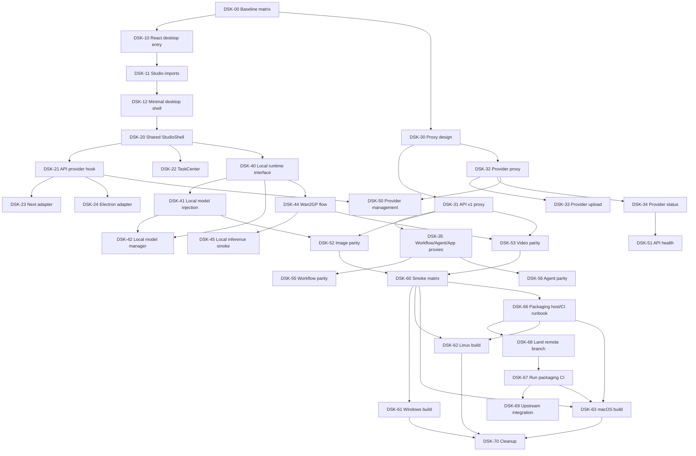

# MozenAIGC Web-to-Desktop Optimization Master Plan

Date: 2026-05-26

## 1. Purpose

This document is the master execution plan for synchronizing the optimized Web experience into the local Electron desktop client.

The goal is not to copy Web changes into a second implementation. The goal is to make the desktop client share the same product surface as the Web app while preserving desktop-only local inference features.

Every follow-up task under this plan must report:

1. Global optimization progress.
2. Phase-level progress.
3. Evidence of completion.
4. Remaining risks or blockers.
5. The new highest-priority 3 subtasks.

## 2. Current Baseline

### 2.1 Existing Desktop Client

The project already has a local desktop client:

- Electron entry: `electron/main.js`
- Preload bridge: `electron/preload.js`
- Desktop build commands: `electron:dev`, `electron:build`, `electron:build:win`, `electron:build:linux`
- Renderer output: `dist/index.html`
- Renderer source: `src/main.js` and `src/components/*.js`

The desktop client currently uses Vite and Vanilla JavaScript components.

### 2.2 Existing Web Optimization Surface

Recent Web optimization work mainly lives in:

- `app/`
- `components/StandaloneShell.js`
- `packages/studio/src/`
- `app/api/**`

The Web app uses Next.js, React, and the shared `packages/studio` workspace package.

### 2.3 Key Architecture Gap

The Web app and the desktop client currently render different code paths:

- Web: Next.js + React + `packages/studio`
- Desktop: Electron + Vite + Vanilla JS in `src/components`

Because of this split, Web optimizations do not automatically reach the desktop client.

The largest technical gap is API routing. Web optimizations depend on Next API routes such as:

- `/api/api/v1/*`
- `/api/provider/v1/*`
- `/api/provider/upload`
- `/api/provider/status`
- `/api/workflow/*`
- `/api/agents/*`
- `/api/app/*`

The Electron desktop client loads a static Vite bundle and does not have these Next API routes at runtime.

## 3. Target Architecture

```text
Web Next.js
  app/
  components/StandaloneShell.js
  app/api/**

Shared Studio Package
  packages/studio/src/**
  ImageStudio
  VideoStudio
  MarketingStudio
  WorkflowStudio
  AgentStudio
  AppsStudio
  ApiProviderStudio
  ApiHealthStudio
  Shared shell and task center

Desktop Electron
  electron/main.js
  electron/preload.js
  electron/lib/localInference.js
  electron/lib/wan2gpProvider.js
  electron/lib/desktopApiProxy.js
  src/desktop/**
```

The desktop renderer should become a React/Vite app that consumes `packages/studio` directly.

Desktop-only local inference should be exposed through a narrow runtime adapter instead of being mixed into duplicated UI components.

## 4. Scope

### 4.1 In Scope

- Move desktop renderer to React/Vite.
- Reuse `packages/studio` components in desktop.
- Extract shared shell state and task center from the Web shell.
- Implement a desktop equivalent for required `/api/**` routes.
- Preserve sd.cpp local image generation.
- Preserve Wan2GP image/video generation.
- Synchronize API Provider management and API health checks.
- Synchronize image, video, marketing, workflow, agent, and app center surfaces.
- Add packaging and smoke-test verification for desktop builds.
- Retire duplicated Vanilla JS studio components after migration.

### 4.2 Out of Scope Unless Reapproved

- Rewriting Electron main process from scratch.
- Replacing Electron with Tauri or another desktop framework.
- Adding new model providers beyond the Web parity target.
- Changing product branding beyond current MozenAIGC naming updates.
- Full account system redesign.

## 5. Progress Model

Global progress is weighted by phases. A task result must update both the phase percentage and the global percentage.

| Phase | Weight | Description |
|---|---:|---|
| P0 | 5% | Baseline, governance, task map, acceptance matrix |
| P1 | 10% | React/Vite desktop renderer shell |
| P2 | 15% | Shared Studio shell extraction |
| P3 | 20% | Desktop API proxy and provider routing |
| P4 | 15% | Desktop local inference integration |
| P5 | 20% | Full feature parity across studio modules |
| P6 | 10% | Packaging, smoke testing, release readiness |
| P7 | 5% | Cleanup, docs, migration closure |

Global progress formula:

```text
global_progress =
  sum(phase_weight * phase_completion_ratio)
```

Initial execution snapshot after this plan is created:

| Metric | Value |
|---|---:|
| Global progress | 3% |
| Completed engineering migration | 0% |
| Planning/governance progress | 60% of P0 |
| Main implementation status | Not started |

## 6. Mandatory Task Result Report Format

Every completed subtask must report in this structure:

```markdown
## Task Result

Completed task:
- [TASK-ID] Task name

Global optimization progress:
- Previous: N%
- Current: N%
- Delta: +N%

Phase progress:
- P0 Baseline: N%
- P1 Desktop React shell: N%
- P2 Shared shell: N%
- P3 Desktop API proxy: N%
- P4 Local inference: N%
- P5 Feature parity: N%
- P6 Packaging QA: N%
- P7 Cleanup: N%

Evidence:
- Files changed:
- Commands run:
- Verification result:

Risks and blockers:
- Risk:
- Mitigation:

New highest-priority 3 subtasks:
1. [TASK-ID] Task name
2. [TASK-ID] Task name
3. [TASK-ID] Task name
```

No subtask should be considered complete without this report.

## 7. Master Task Breakdown

### P0. Baseline and Governance

| ID | Task | Priority | Estimate | Dependencies | Acceptance |
|---|---|---:|---:|---|---|
| DSK-00 | Freeze desktop/Web baseline and acceptance matrix | P0 | 0.5d | None | Matrix lists current Web features, current desktop gaps, target parity, and smoke tests |
| DSK-01 | Inventory all Web optimization files and API routes | P0 | 0.5d | DSK-00 | Route/component inventory maps each Web feature to desktop migration needs |
| DSK-02 | Create risk register and rollback policy | P1 | 0.5d | DSK-00 | Risks include API proxy, local inference, packaging, secrets, and build compatibility |
| DSK-03 | Define progress ledger update process | P1 | 0.25d | This document | Future task reports follow the mandatory format |

### P1. React/Vite Desktop Renderer Shell

| ID | Task | Priority | Estimate | Dependencies | Acceptance |
|---|---|---:|---:|---|---|
| DSK-10 | Add React desktop renderer entry under `src/desktop` | P0 | 1d | DSK-00 | Vite builds a React renderer and Electron loads it |
| DSK-11 | Configure Vite aliases and workspace imports for `packages/studio` | P0 | 0.5d | DSK-10 | Desktop renderer imports shared Studio components without bundle errors |
| DSK-12 | Render a minimal desktop shell with Image/Video/API tabs | P0 | 1d | DSK-10, DSK-11 | Desktop opens and renders shared components with no blank screen |
| DSK-13 | Add desktop navigation adapter replacing Next router assumptions | P1 | 1d | DSK-12 | Tab changes work in Electron without Next routing |
| DSK-14 | Keep legacy renderer available as temporary fallback | P2 | 0.5d | DSK-10 | Old `src/main.js` path remains recoverable until migration is verified |

### P2. Shared Studio Shell Extraction

| ID | Task | Priority | Estimate | Dependencies | Acceptance |
|---|---|---:|---:|---|---|
| DSK-20 | Extract shared `StudioShell` from Web `StandaloneShell` | P0 | 1.5d | DSK-12 | Web and desktop can render the same shell with adapters |
| DSK-21 | Extract API provider state hook | P0 | 1d | DSK-20 | API config persistence, cookies/storage sync, and legacy key migration are reusable |
| DSK-22 | Extract shared `TaskCenter` component | P1 | 1d | DSK-20 | Task center reads image/video histories and works in Web and desktop |
| DSK-23 | Create Next adapter for routing and cookies | P1 | 0.5d | DSK-20, DSK-21 | Existing Web routes still work |
| DSK-24 | Create Electron adapter for routing and storage | P1 | 1d | DSK-20, DSK-21 | Desktop shell works without Next-specific APIs |
| DSK-25 | Add shell-level regression tests or smoke script | P2 | 1d | DSK-23, DSK-24 | Basic render and tab tests pass for both targets |

### P3. Desktop API Proxy and Provider Routing

| ID | Task | Priority | Estimate | Dependencies | Acceptance |
|---|---|---:|---:|---|---|
| DSK-30 | Decide desktop proxy transport design | P0 | 0.5d | DSK-00 | Decision records local HTTP server vs IPC/fetch interception approach |
| DSK-31 | Implement `/api/api/v1/*` desktop proxy | P0 | 2d | DSK-30 | Image/video submit and poll requests work through desktop proxy |
| DSK-32 | Implement `/api/provider/v1/*` desktop proxy | P0 | 1.5d | DSK-30 | HFSY/Yunwu/OpenAI-compatible provider requests work |
| DSK-33 | Implement `/api/provider/upload` desktop upload adapter | P0 | 1d | DSK-32 | HFSY provider image upload returns usable remote URLs or clear errors |
| DSK-34 | Implement `/api/provider/status` desktop status endpoint | P1 | 0.75d | DSK-32 | API health page can show provider/model readiness |
| DSK-35 | Implement `/api/workflow/*`, `/api/agents/*`, `/api/app/*` desktop proxies | P1 | 2d | DSK-31 | Workflow, agent, and app center shared clients can call desktop proxy |
| DSK-36 | Add proxy security hardening and redacted logging | P0 | 0.75d | DSK-31, DSK-32 | No API key appears in logs; timeouts and upstream errors are normalized |
| DSK-37 | Add proxy smoke tests with mocked upstream responses | P2 | 1.5d | DSK-31, DSK-32 | Submit, poll, upload, and provider status flows pass mocked tests |

### P4. Desktop Local Inference Integration

| ID | Task | Priority | Estimate | Dependencies | Acceptance |
|---|---|---:|---:|---|---|
| DSK-40 | Define `localRuntime` interface for shared Studio components | P0 | 1d | DSK-20 | Shared components can receive optional local runtime capabilities |
| DSK-41 | Inject sd.cpp and Wan2GP model catalogs into shared model picker | P0 | 1.5d | DSK-40 | Desktop shows local models only when Electron local runtime is available |
| DSK-42 | React-ize Local Model Manager | P1 | 2d | DSK-40 | Install/download/delete/probe controls work in desktop shell |
| DSK-43 | Route local generation results into shared task center | P1 | 1d | DSK-22, DSK-40 | Local results appear in unified task history |
| DSK-44 | Preserve Wan2GP upload and generation flow | P0 | 1.5d | DSK-40, DSK-41 | Wan2GP image/video generation works through Electron bridge |
| DSK-45 | Add local inference smoke test checklist | P1 | 0.5d | DSK-41, DSK-44 | Checklist covers sd.cpp image and Wan2GP video path |

### P5. Full Feature Parity

| ID | Task | Priority | Estimate | Dependencies | Acceptance |
|---|---|---:|---:|---|---|
| DSK-50 | Sync API Provider Management UI | P0 | 1d | DSK-21, DSK-32 | Desktop can create, edit, switch, export, and persist providers |
| DSK-51 | Sync API Health UI | P1 | 0.5d | DSK-34 | Desktop API health works with provider status endpoint |
| DSK-52 | Sync Image Studio optimizations | P0 | 2d | DSK-31, DSK-40 | New models, multi-image references, provider whitelist, and local generation work |
| DSK-53 | Sync Video Studio optimizations | P0 | 3d | DSK-31, DSK-40, DSK-44 | Seedance 2, I2V, V2V, extend, recovery, and local Wan2GP video work |
| DSK-54 | Sync Marketing Studio | P1 | 1.5d | DSK-31 | Marketing generation works and stores results |
| DSK-55 | Sync Workflow Studio | P1 | 2d | DSK-35 | Templates, user workflows, execution, and node views work or show clear provider limitation |
| DSK-56 | Sync Agent Studio | P1 | 2d | DSK-35 | Agent listing, chat, create/edit flows work or show clear provider limitation |
| DSK-57 | Sync Apps Studio | P2 | 1d | DSK-35 | App center loads and records interest/usage flows |
| DSK-58 | Decide Codex Lab desktop behavior | P2 | 0.5d | DSK-12 | Keep Web-only, add desktop route, or explicitly hide |

### P6. Packaging, QA, and Release Readiness

| ID | Task | Priority | Estimate | Dependencies | Acceptance |
|---|---|---:|---:|---|---|
| DSK-60 | Create desktop smoke-test matrix | P0 | 0.5d | DSK-12 | Matrix covers Windows, macOS, Linux, Web parity, and local inference |
| DSK-61 | Verify Windows build and install | P1 | 1d | P1-P5 core complete | NSIS installer launches and smoke tests pass |
| DSK-62 | Verify Linux AppImage and DEB | P1 | 1d | P1-P5 core complete | Linux app launches with AppArmor notes still valid |
| DSK-63 | Verify macOS DMG behavior | P1 | 1d | P1-P5 core complete | DMG launches after documented Gatekeeper steps |
| DSK-64 | Verify secrets are not bundled or logged | P0 | 0.5d | DSK-36 | Build artifacts and logs contain no provider API keys |
| DSK-65 | Verify Web app did not regress | P0 | 1d | DSK-23 | Next build and key Web flows pass |
| DSK-66 | Add packaging host/CI runbook | P0 | 0.5d | DSK-61, DSK-62, DSK-63 attempts | Repeatable Linux and macOS packaging prerequisites, commands, and artifact checks are documented |
| DSK-67 | Run packaging CI and attach artifacts | P0 | 0.5d | DSK-66 | GitHub Actions packaging run produces Linux and macOS artifacts with validation logs |
| DSK-68 | Land packaging workflow branch on remote | P0 | 0.5d | DSK-66 | Current desktop migration and packaging workflow are committed and pushed to a remote `codex/**` branch so CI can run |
| DSK-69 | Open upstream integration PR or obtain upstream write access | P0 | 0.5d | DSK-68, DSK-67 | The passing fork branch is available to `Anil-matcha/Open-Generative-AI` through a PR, maintainer-pushed branch, or granted write access |

### P7. Cleanup and Closure

| ID | Task | Priority | Estimate | Dependencies | Acceptance |
|---|---|---:|---:|---|---|
| DSK-70 | Remove or archive old Vanilla JS desktop studios | P2 | 1d | P6 smoke pass | No unused duplicated studio implementation remains in active path |
| DSK-71 | Update README architecture section | P1 | 0.5d | DSK-70 | README accurately describes Web/Desktop/shared architecture |
| DSK-72 | Update project knowledge docs | P1 | 0.5d | DSK-70 | `project_knowledge.md` no longer describes stale Vanilla-only architecture |
| DSK-73 | Prepare release notes and migration summary | P1 | 0.5d | P6 smoke pass | Release notes list desktop parity, local inference, and known limitations |

## 8. Dependency Map



## 9. Highest-Priority 3 Subtasks Now

Latest progress is tracked in `docs/product/2026-05-26-desktop-web-sync-progress-ledger.md`.

Current weighted global progress: 90%.

Current next three tasks:

1. DSK-63: Complete clean macOS account launch and Gatekeeper/quarantine verification from the `desktop-macos` CI artifact.
2. DSK-69: Open an upstream PR from `MookeeHugo/Open-Generative-AI:codex/internal-multimodal-lab` or obtain write access to push the passing branch to `Anil-matcha/Open-Generative-AI`.
3. DSK-70: Remove or archive the old Vanilla JS desktop renderer after DSK-63 clean-account launch is confirmed.

Rationale:

- DSK-61 is accepted for the Windows workstation: NSIS installer built, silent install completed, and the installed app launched with a responding process.
- DSK-62 is accepted for Linux Docker/CI smoke: AppImage and DEB artifacts were produced, AppImage extract-and-run stayed alive until timeout, and DEB installed to `/opt/MozenAIGC` before staying alive under `xvfb`.
- DSK-63 has passed CI DMG build, `hdiutil verify`, `codesign --verify --deep --strict`, packaged secrets audit, and artifact upload on `macos-latest`; it still needs one clean-account launch/Gatekeeper verification before release acceptance.
- DSK-66 and DSK-67 are complete on the fork branch: `docs/product/2026-05-26-desktop-packaging-runbook.md`, CI package scripts, and `.github/workflows/desktop-packaging.yml` define and execute repeatable Linux/macOS packaging checks. Desktop Packaging run `26420279302` succeeded and uploaded `desktop-linux` and `desktop-macos`.
- DSK-68 is complete with caveat: the branch was pushed to `MookeeHugo/Open-Generative-AI` because direct push to `Anil-matcha/Open-Generative-AI` was denied for the current GitHub user.
- DSK-70 is ready but gated: `docs/product/2026-05-26-desktop-legacy-archive-readiness.md` identifies the legacy fallback entry points and files, but cleanup should wait until DSK-63 clean-account launch is accepted.

## 10. Milestones

| Milestone | Target Tasks | Exit Criteria |
|---|---|---|
| M1 Desktop React boots | DSK-10 to DSK-13 | Electron opens shared React shell |
| M2 Provider path works | DSK-30 to DSK-34, DSK-50, DSK-51 | Desktop can configure provider, health-check, and generate image |
| M3 Image/video parity | DSK-52, DSK-53 | Desktop image/video match Web optimized flows |
| M4 Local inference restored | DSK-40 to DSK-45 | sd.cpp and Wan2GP work in new React shell |
| M5 Workflow/Agent/App parity | DSK-55 to DSK-57 | Non-core studios work or degrade clearly |
| M6 Release-ready desktop | DSK-60 to DSK-65 | Windows/Linux/macOS smoke tests pass |
| M7 Cleanup complete | DSK-70 to DSK-73 | Old duplicate implementation retired and docs updated |

## 11. Risk Register

| Risk | Impact | Probability | Mitigation |
|---|---|---:|---|
| Desktop static renderer lacks Next API routes | High | High | Build desktop API proxy before feature parity work |
| Local inference regressions during React migration | High | Medium | Define `localRuntime` adapter and test sd.cpp/Wan2GP before cleanup |
| Duplicated shell logic continues to diverge | High | Medium | Extract shared `StudioShell` and adapters early |
| Provider secrets appear in logs | High | Medium | Redacted logging and build artifact checks |
| Electron packaging misses new proxy files | Medium | Medium | Update `electron-builder` file list and run package smoke tests |
| Web regressions from shared shell extraction | High | Medium | Keep Next adapter and run Web build/smoke checks |
| Workflows/agents rely on provider capabilities not available in desktop config | Medium | Medium | Show capability-aware empty/error states |

## 12. Definition of Done

The global task is complete when:

1. Electron desktop uses the shared React Studio surface.
2. Web and desktop share `packages/studio` for primary studios.
3. Desktop implements required API proxy behavior for Web parity.
4. Desktop preserves sd.cpp and Wan2GP local inference.
5. API Provider management and health checks work in desktop.
6. Image, video, marketing, workflow, agent, and app center have parity or documented intentional desktop limitations.
7. Windows, Linux, and macOS desktop packages pass smoke verification.
8. Old duplicated Vanilla JS studio components are removed or clearly archived.
9. README and project knowledge docs match the new architecture.
10. Final report shows 100% global progress and no open release-blocking risks.
